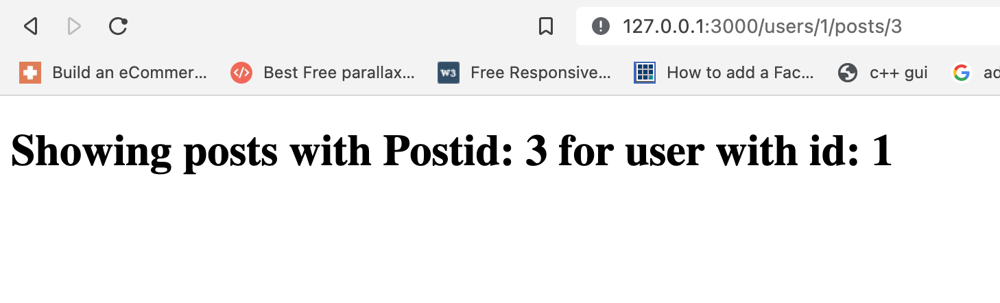

# RUBY BLOG APP
In this project, i develop a fully functional blog that can authenticate and authorize users using devise. I also write a backend api with rails, swagger-Ui documentation and rspec tests.

## objectives

- Use controllers to handle requests and render empty views.
- Install Ruby on Rails framework.
- Use Ruby Gems as a software packages system.
- Understand Rails naming conventions.
- Use params from browser requests in a safe way.

## Built With
- Ruby on Rails
- Gems
  - Rspec
  - Capybara
  - Swagger-UI
  - JWT Authentication
  - FactoryBot
  - Selenium-webdriver
  - Bcrypt
  - Letter-opener
  - Faker
  - cancancan
  - Devise

## Getting Started
- Make sure you have Ruby installed in your system.
- You can install it [here](https://www.ruby-lang.org/en/documentation/installation/).

Clone this repository by running `https://github.com/billionsjoel/rails-blog.git` in your command line.

Navigate to the repository by running `cd rails-blog`.

## Installation
- Clone the repo and run `bundle install` in the command line to install the dependencies.
- run `rails s`

## API Documentation using SWAGGER-UI
Open [http://localhost:3000/api-docs/index.html](http://localhost:3000/api-docs/index.html) in your browser

## Author

👤 **Atugonza Joel Billions**

- GitHub: [@billionsjoel](https://github.com/billionsjoel)
- LinkedIn: [Billionsjoel](https://www.linkedin.com/in/billionsjoel/)

## 🤝 Contributing

Contributions, issues, and feature requests are welcome!

Feel free to check the [issues page](https://github.com/billionsjoel/rails-blog/issues).

## Show your support

Give a ⭐️ if you like this project!

## Acknowledgments

- Coding partner, Standup and morning session team